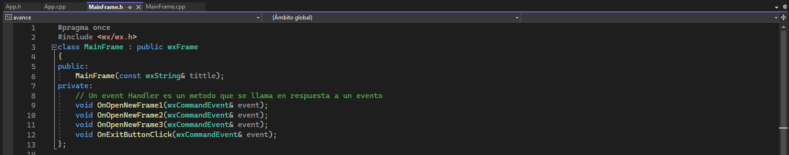
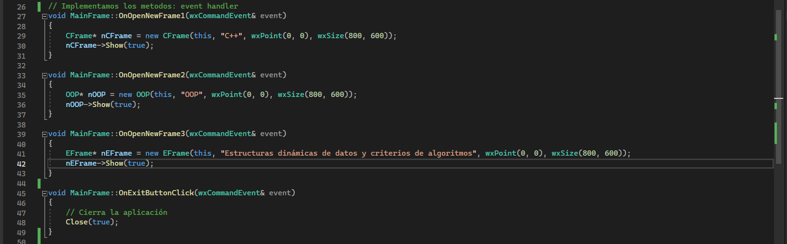
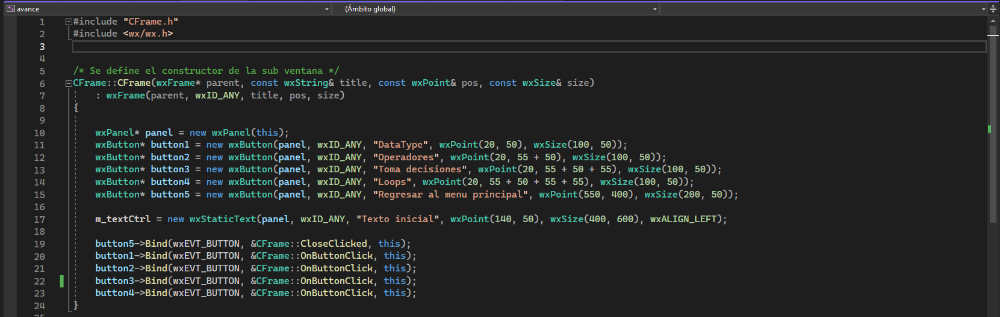

# Propuesta del proyecto
## Descripción general de la aplicación educativa
Se propone crear una interfaz gráfica que permita al usuario aprender sobre estructuras de datos y algoritmos de ordenamiento. En primer lugar, se planea crear un menú principal el cual debe contener como mínimo tres botones: Estructuras de datos, algoritmos de ordenamiento y salir. AL ingresar al primer botón (Estructuras de datos), se debe abrir una pantalla nueva, la cual debe contener los siguientes botones: arreglos, listas enlazadas, cola, pila, árbol binario de búsqueda, diccionario, cola de prioridad, grafo y regresar al menu principal. AL estripar cada uno de estos botones, se debe desplegar una ventana informativa asociada al tema correspodiente. Dicha ventana debe contener como mínimo: información relevante sobre la estructura de datos y un ejemplo (imagen) que demuestre su aplicabilidad. Por otra parte, al ingresar en el segundo botón (algoritmos de ordenamiento), se debe desplegar una pantalla nueva, la cual debe contener los siguientes botones: burbuja, inserción, selección, fusión,
rápido, análisis de su complejidad y eficiencia, y regresar al menu principal. Al estripar cada uno de estos botones, se debe desplegar una ventana informativa asociada al tema correspodiente, la cual debe contener al menos una imagen que clarifique la explicación de cada tema. Por último, se tiene el boton salir, el cual termina la ejecución del programa. Cabe destacar que, de manera opcional, en el menú principal se podría añadir un cuarto botón denominado: recursos online, el cual contenga distintos enlaces con información relevante referente a los dos temas centrales (estructuras de datos y algoritmos de ordenamiento).

## Librerías
### Win32 API
La API de Windows (WinAPI) es un conjunto de funciones que permiten a los desarrolladores crear aplicaciones para el sistema operativo Windows. La API de Windows se compone de varios módulos y bibliotecas que abarcan una amplia gama de funciones de bajo y alto nivel. Aunque tiene muchas ventajas, tales como:

* Tener acceso completo a funcionalidades de Windows: WinAPI ofrece acceso completo a las funcionalidades de bajo nivel del sistema operativo Windows, lo que permite un control detallado sobre el funcionamiento de la aplicación y la interacción con el sistema operativo.

* Alto rendimiento: Al ser una API de bajo nivel, WinAPI está optimizada para ofrecer un rendimiento rápido y eficiente. Esto es especialmente útil en aplicaciones que requieren un uso intensivo de recursos o que necesitan un alto grado de control sobre el hardware y los recursos del sistema.

* Soporte de largo plazo: Dado que la WinAPI es parte integral del sistema operativo Windows, Microsoft generalmente proporciona un soporte de largo plazo para las aplicaciones desarrolladas utilizando esta API. Esto garantiza la estabilidad y la compatibilidad de las aplicaciones incluso en versiones posteriores de Windows.

Cabe destacar que es una herramienta ampliamente utilizada en el desarrollo de aplicaciones para Windows, pero también presenta algunas desventajas, que incluyen:

* Complejidad: La WinAPI puede resultar complicada de utilizar, especialmente para aquellos que no están familiarizados con los conceptos de programación de bajo nivel y la arquitectura de Windows.

* Falta de portabilidad: La WinAPI está específicamente diseñada para aplicaciones que se ejecutan en el sistema operativo Windows, lo que limita su portabilidad a otros sistemas operativos. Esto puede ser una desventaja si se necesita llevar las aplicaciones a distintas plataformas.  

* Riesgo de errores de bajo nivel: Al trabajar directamente con la API de Windows, existe un mayor riesgo de cometer errores de bajo nivel que podrían afectar el rendimiento, la estabilidad y la seguridad de la aplicación. 

### QT
Qt es un conjunto de herramientas de desarrollo de software de código abierto ampliamente utilizado para crear aplicaciones de software con interfaces gráficas de usuario (GUI). Tiene ventajas tales como:

* Portabilidad multiplataforma: Qt permite el desarrollo de aplicaciones que pueden ejecutarse en diversas plataformas, como Windows, macOS, Linux, Android e iOS, con un código fuente común. Esto simplifica en gran medida el proceso de desarrollo y facilita la creación de aplicaciones que pueden llegar a una amplia audiencia de usuarios en diferentes sistemas operativos.

* Comunidad activa y soporte profesional: Qt cuenta con una comunidad activa de desarrolladores y usuarios que pueden proporcionar soporte y orientación. Además, The Qt Company, la entidad responsable de Qt, ofrece soporte profesional y servicios de consultoría para empresas que necesitan asistencia adicional en el desarrollo de sus aplicaciones.

* Flexibilidad y extensibilidad: Qt es altamente flexible y extensible, lo que permite a los desarrolladores ampliar su funcionalidad según sea necesario. Esto facilita la adaptación de la biblioteca a una variedad de casos de uso y requisitos específicos del proyecto. Ademas con su herramienta de diseño grafico hace más sencilla la labor de diseño de aplicaciones.

A pesar de ser una de las bibliotecas de interfaz gráfica de usuario (GUI) más populares y poderosas, la biblioteca QT también presenta algunas limitaciones y desventajas. Algunas de estas desventajas son:

* Espacio en la memoria y tamaño del paquete: La biblioteca QT puede aumentar el tamaño de los archivos ejecutables y las bibliotecas dinámicas debido a sus amplias funcionalidades y su naturaleza orientada a objetos. Esto puede ser un inconveniente en situaciones en las que el tamaño de la aplicación es una consideración crítica, como en el desarrollo de aplicaciones para dispositivos con recursos limitados.

* Dependencias no incluidas: Al utilizar QT, las aplicaciones pueden tener dependencias adicionales que deben distribuirse junto con la aplicación. Esto puede generar problemas de compatibilidad o instalación en sistemas donde estas dependencias no están disponibles o son difíciles de administrar.

* Licencias: Si bien QT es de código abierto y tiene una versión de la comunidad, algunas características y herramientas avanzadas pueden requerir una licencia comercial, lo que puede resultar costoso para proyectos empresariales o de mayor escala.

* Desempeño: En comparación con bibliotecas de interfaz de usuario más livianas, QT puede consumir más recursos del sistema y tener un rendimiento ligeramente inferior en sistemas con capacidades limitadas o en aplicaciones que requieren un rendimiento extremadamente alto.

### wxWidgets
wxWidgets es un framework de código abierto en C++ que te permite escribir aplicaciones de interfaz gráfica (GUI) que funcionan en varias plataformas y se ven y se sienten nativas, tanto en C++ como en otros lenguajes de programación. A continuación se enlistan algunas de las ventajas que se encontraron luego de investigar la librería wxWidgets:

* Portabilidad multiplataforma: Basta con escribir el código de la GUI una sola vez, ya que es posible ejecutarlo en diferentes sistemas operativos, como Windows, Unix y macOS. Además, el aspecto de la interfaz se adapta al aspecto nativo del sistema operativo. 

* Comunidad activa y soporte profesional: Hay bastante documentación, foros y recursos en YouTube. Actualmente, la pagina oficial cuenta con mas de 100 ejemplos de programas.

* Codigo simple: En comparación a otros programas para crear GUI (como Win32 API), el código que se requiere para crear una GUI basica, requiere de menos lineas de código en wxWidgets. Asimismo, el código puede llegar a ser sencillo de entender, lo cual es fundamental para disminuir el impacto de la curva de aprendizaje.

* Costo: Es un software de código abierto completamente gratuito, sin ningun tipo de restricción. Esto es una gran ventaja sobre Qt, ya que este sí tiene algunas licencias de pago.

Por otro lado, wxWidgets cuenta con ciertas desventajas, las cuales se muestran a continuacion:

* Visual designer: A diferencia de QT, wxwidgets no cuenta con una herramienta visual que ayude a diseñar la GUI.

* Aplicaciones simples: Con wxWidgets se pueden crear interfaces para aplicaciones simples. Cuando la aplicación tiene un grado de complejidad alto, es recomendable usar Qt, debido a los features que este puede llegar a brindar dependiendo de la licencia que se pague. 

### Elección final
En base a la información proporcionada anteriormente, las mejores librerías son QT y wxWidgets. Ahora bien, a pesar de que Qt cuenta con una herramienta visual para crear la GUI, se elige wxWidgets, debido a que es completamente gratuito. Asimismo, dado que wxWidgets no cuenta con una herramienta visual para crear la GUI, se tiene certeza de que todo el codigo creado en wxWidgets es el encargado de generar toda la GUI. Esto garantizará una mejor comprensión del funcionamiento de la GUI creada, lo cual será fundamental para debuggear apropiadamente. De igual forma, la aplicación para la cual se va a crear la GUI no es compleja, por lo que se tiene certeza que wxWidgets proporcionara las herramientas necesarias para crear una interfaz apropiada. Por último, se encontraron mejores recursos en internet para aprender con wxWidgets en comparación a los encontrados para Qt.

## Plan de trabajo
A nivel general, el plan de trabajo se puede dividir en las fases que se muestran en el siguiente diagrama de bloques: 

A nivel más específico, se pueden llevar a cabo los siguientes pasos para ir cumpliendo las diferentes fases que se muestran en el diagrama de bloques anterior:

1. Investigar las diferentes clases y funciones que posee la librería wxWidgets.

2. Buscar códigos base como ejemplo para tener un mejor entendimiento.

3. Crear una GUI sencilla y entender bien su funcionamiento.

4. Investigar cómo crear una segunda interfaz a partir de una primera GUI, usando botones.

5. Crear una interfaz primaria y secundaria, de modo que estando en la primaria se pueda abrir la interfaz secundaria y viceversa.

6. Recolectar toda la información e imágenes que se van a incluir en el proyecto, referente a estructuras de datos y algoritmos de ordenamiento.

7. Crear todas las pantallas necesarias y conectarlas entre sí para crear el proyecto propuesto.

## Caracteristicas principales de la aplicacion

1. Menu central para ir a las diferentes secciones

2. Diferente pantalla con informacion de cada una de las secciones

3. Codigo real de ejemplos de las diferentes secciones

4. Ilustraciones para ejemplificar de manera visual ciertos procedimientos/definiciones

5. Mini cuestionario al final de cada seccion

# Avance
## Partes de la GUI creadas
### 1- Menú principal
En primer lugar, se logra crear una interfaz gráfica, tal y como se muestra en la siguiente figura. Esta ventana contiene 4 botones: C/C++, OPP,
Estructuras y Salir. Los primeros tres botones constituyen los 3 temas principales que se pretenden tocar al ingresar en cada uno de ellos. 

Para poder implementar la ventana anterior, considere las tres figuras que se muestran a continuación. La primera figura muestra el contenido del archivo App.h. Aquí se muestra la clase App con un metodo llamado OnInit. Esta función es semejante a la función init main que se utiliza típicamente en cualquier código de C++. Esta función constituye el punto de entrada de todo el programa cuando se trabaja con una interfaz gráfica en WXwidgets. En la segunda figura (que constituye al archivo App.cpp), se muestra la implementación del método OnInit. Note que se crea un objeto de la clase MainFrame, la cual se muestra en la tercer figura. Asimismo, se aplican al objeto (ventana) tres métodos de la clase wxString: SetClientSize, Center y Show. Estos métodos permiten establecer el tamaño de la ventana, la ubicación de esta y permiten mostrarla, ya que por default esta se encuentra oculta. Por ultimo, el método OnInit devuelve True para que la aplicación siga activa. En otras palabras, a partir de este punto, el programa se queda esperando por la presencia de algún evento provocado por el usuario, es decir, a partir de este punto, el usuario decide el camino de ejecución. 

En la imagen anterior se muestra el archivo MainFrame.hpp. A continuación, se muestra su respectiva implementación mediante el archivo MainFrame.cpp. Inicialmente, se define el constructor de dicha clase. Dentro de este método, se crean distintos objetos punteros (botones) de la clase wxButton y se almacenan en memoria dinámica. Cada uno de estos objetos recibe en sus parámetros, al objeto puntero panel, el cual me permite limitar el tamaño dsiponible para el botón, en conjunto con wxPoint( ) y wxSize( ), que me definen la ubicación y las dimensiones del botón respectivamente. 

Por otro lado, un evento es generado cuando el usuario interactua con la GUI. Por ejemplo, cuando el usuario estripa algun botón, escribe en el teclado, reajusta el tamaño de la ventana, etc. En wxWidgets hay dos formas para detectar eventos y ejecutar un código en base al tipo de evento: Static Event Handling y Dynamic Event Handling. Para este caso, se trabajaran los eventos de forma dinámica, ya que de forma estática se tienen diferentes limitaciones. Para poder detectar algún evento, debemos crear un event handler asociado a dicho evento. Un event handler es simplemente un método (en este caso de la clase MainFrame) que es llamado cuando un evento en particular ocurre. De esta forma, en la imagen anterior (archivo: MainFrame.hpp), se muestra la declaración de 4 métodos event handler, y su respectiva implementación se muestra a continuación (en el archivo MainFrame.cpp) . Como se muestra, en los métodos OnOpenNewFrameX, se busca abrir una nueva ventana cuando el boton X es estripado. Ahora bien, ¿Cómo hacemos la conexión entre el evento de "estripar un bóton" y la ejecución de los métodos event handler OnOpenNewFrameX? Bueno, esa conexión se llama Binding y se implementa mediante el método Bind que se encuentra definido en la clase wxEBTHandler. No obstante, cada uno de los objetos (botones) creados puede acceder a sus métodos, ya que todas las clases asociadas a algún botón, constituyen clases hijas de la clase wxEBTHandler. Este método recibe como parámetros : la clase asociada al evento (wxEVT_BUTTON = "click en un botón" ) , el método asociado al evento (OnOpenNewFrameX) y por último, el objeto que se va a recibir el evento (this = ventana actual).De esta forma, se aplican este método 4 veces, ya que hay 4 botones.

En la figura anterior, note que en los métodos OnOpenNewFrameX se crea otro objeto, el cual constituye otra ventana. Es decir, al estripar cualquiera de los botones: C/C++, OPP,
Estructuras, se crea un nuevo objeto. Por un tema de orden y modularidad, las tres ventanas creadas, se trabajan en archivos indepdientes: CFrame (.cpp y .h)  ,OPP (.cpp y .h) y EFrame (.cpp y .h). 

### 2- Segunda Ventana ( Temas de C/C++ )
Al estripar el botón C/C++, se abre la ventana que se muestra a continuación. 

Al estripar cualquier botón, se despliega un texto asociado al tema. De momento, no se ha incorporado la información respectiva, pero se planea incluir una explicación sencilla que incluya al menos una imagen que permita ilustrar el tema correspondiente. Esto se puede observar a continuación. Asimismo, al estripar el bóton "Regresar al menú principal", el programa logra cerrar la ventana.

Para poder implementar la ventana mostrada anteriormente, se emplean los archivos CFrame.cpp y CFrame.h, tal y como se muestra a continuación. A nivel conceptual, esta ventana; al igual que las otras dos ventanas auxiliares, implementa la misma metodología para trabajar con los eventos. No obstante, los métodos event handler definidos en esta ventana al estripar alguno de los botones, llevan a cabo diferentes tareas en comparación a las acciones que se realizaban en el menú principal. El método CloseClicked se utiliza para cerrar la ventana mediante la función Close(), y de esta forma, poder regresar al menú principal. El método OnButtonClick es llamado cada vez que el usuario estripa cualquiera de los botones disponibles, a excepción del botón: "Regresar al menú principal". Cuando se llama a este método, el objeto asociado al botón estripado se almacena en otro botón temporal de forma dinámica. Seguidamente, se logra determinar cual botón fue estripado al reconocer el buttonText del botón temporal, mediante una serie de condicionales if-else, y se procede a llamar al método UpdateText. Este método se encarga de actualizar en la ventana actual el texto mostrado.  

### 3- Tercera Ventana ( Temas de programación orientada a objetos (OOP) )

Al estripar el botón OOP, se abre la ventana que se muestra a continuación. Al estripar cualquier botón, se despliega un texto asociado al tema. De momento, no se ha incorporado la información respectiva, pero se planea incluir una explicación sencilla que incluya al menos una imagen que permita ilustrar el tema correspondiente. Esto se puede observar a continuación. Asimismo, al estripar el bóton "Regresar al menú principal", el programa logra cerrar la ventana. Cabe destacar que, a nivel de código, la implementación es la misma con respecto a la ventana de C/C++ explicada anteriormente, razón por la cual, no se incluye el código correspondiente.

### 4- Cuarta Ventana ( Temas de estructuras dinámicas de datos y criterios de algoritmos )

Al estripar el botón Estructuras , se abre la ventana que se muestra a continuación. Al estripar cualquier botón, se despliega un texto asociado al tema. De momento, no se ha incorporado la información respectiva, pero se planea incluir una explicación sencilla que incluya al menos una imagen que permita ilustrar el tema correspondiente. Esto se puede observar a continuación. Asimismo, al estripar el bóton "Regresar al menú principal", el programa logra cerrar la ventana. Cabe destacar que, a nivel de código, la implementación es la misma con respecto a la ventana de C/C++ explicada anteriormente, razón por la cual, no se incluye el código correspondiente.

## Desafíos y Soluciones

* Inicialización del programa con wxWidgets: Al inicio se creía que, como cualquier otro programa en C++, el programa debía iniciar dentro de la función int main( ). Sin embargo, se tenían errores de compilación. Como solución, se investigó que wxWidgets utiliza MACROS, los cuales son fragmentos de código predefinidos que se expanden durante la compilación para simplificar procesos. Uno de esos procesos es la inicialización de un programa. En efecto, se emplea el macro: wxIMPLEMENT_APP, el cual simplifica la inicialización de la aplicación (clase App) en wxWidgets , ya que genera automáticamente el punto de entrada principal (int main()) y otras configuraciones necesarias para que la aplicación funcione correctamente. 

* Entender el manejo eventos dinámico: Entender de forma correcta el funcionamiento de esta librería a tomado tiempo considerable, sin embargo se ha logrado  tener un buen manejo de conceptos relacionado al manejo de Eventos y los distintos objetos y clases con las que wxWidgets trabaja para crear botones y ventanas. Como solución, se buscaron ejemplos sencillos en internet para ir entendiendo poco a poco el funcionamiento detrás de crear una GUI. Gracias a ello, se ha podido entender cómo se capturan eventos a través del método Bind y de los métodos de tipo event handler.

* Manejo de memoria dinámica: Al inicio se tenían dudas sobre cómo administrar la memoria dinámica, ya que, como se pudo observar en el código proporcionado, cada objeto creado, practicamente se almacenaba en la memoria dinámica. Como solución, se pudo investigar que wxWidgets se encarga de devolver el espacio de memoria ocupado, una vez que se cierran todas las ventanas. 

## Bibliografía

- wxWidgets Cross-Platform GUI Library. (s/f). Wxwidgets.org. Recuperado el 22 de octubre de 2023, de https://www.wxwidgets.org/

- Sciber [@wearesciber]. (2021, noviembre 6). BEST GUI TOOLKITS for C++ | Sciber. Youtube. https://www.youtube.com/watch?v=UpREGWu7Oig

- OttoBotCode [@OttoBotCode]. (2022, febrero 9). C++ GUI programming for beginners | episode 0 - introduction. Youtube. https://www.youtube.com/watch?v=BjQhp0eHmJw

- Codigazo [@Codigazo]. (2021, marzo 1). Cómo hacer una interfaz gráfica en C++. Youtube. https://youtu.be/8p9CQPmwxvo

- Codigazo [@Codigazo]. (2021, marzo 31). ¿Que es Winapi y para que sirve?. Youtube. https://youtu.be/zOmsCzkxQlg

- Qt GUI wiki (s/f). https://wiki.qt.io/Main Recuperado el 22 de octubre de 2023, de https://wiki.qt.io/Main